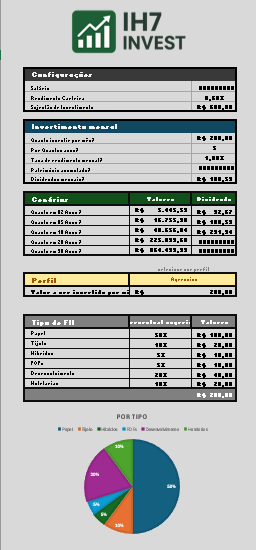

# 📊 IH7 INVEST — Simulador de Investimentos em FIIs no Excel



O **IH7 INVEST** é uma ferramenta desenvolvida em Excel para simular investimentos em **Fundos Imobiliários (FIIs)** de maneira prática, visual e personalizada. Ideal para quem está começando ou quer organizar melhor os aportes mensais e entender a evolução do seu patrimônio ao longo do tempo.

## ✅ Funcionalidades

- **Simulação de Investimentos Mensais**
  Defina quanto pode investir por mês e veja o impacto ao longo dos meses.

- **Projeção de Cenários**
  Compare até 6 possibilidades diferentes de rendimento e acompanhe quanto seu patrimônio pode render.

- **Perfil do Investidor**
  Descubra como seu perfil influencia na distribuição dos seus investimentos entre os tipos de FIIs.

- **Distribuição por Tipo de FII**
  Visualize os percentuais investidos em: Papel, Tijolo, Híbridos, Recebíveis, etc.

- **Gráficos Visuais e Automáticos**
  Tudo automatizado! O Excel calcula e atualiza os valores e gráficos assim que você preenche as células de entrada.

## 🧩 Recursos utilizados

- **Fórmulas**: SE, SOMASE, TABELA DINÂMICA, GRÁFICOS DE PIZZA e muito mais.
- **Formatação Condicional** para facilitar a leitura.
- **Organização por Blocos Temáticos**: Configurações, Investimento Mensal, Projeções, Perfil, Tipos de FII.
- **Layout profissional** e design limpo, com logo exclusivo da ferramenta.

## 📂 Estrutura do Projeto

```
├── IH7_Invest.xlsx         # Arquivo Excel com a ferramenta completa
├── README.md               # Arquivo de documentação
└── dashboard.png           # Captura de tela da ferramenta

```

> 💡 **Dica:** Para alterar o valor investido ou o tempo de simulação, basta mudar os campos de entrada no Excel e observar as atualizações automáticas nos valores e gráficos.

---

**Gostou?** Deixe seu ⭐ no repositório e compartilhe com quem também quer aprender a investir melhor!
